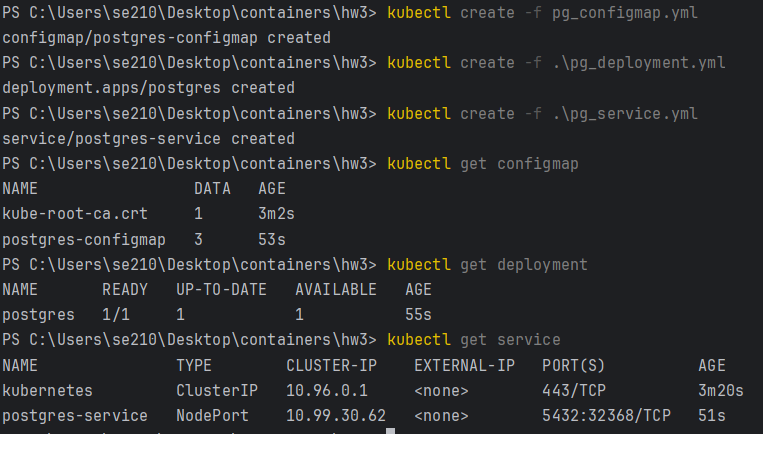
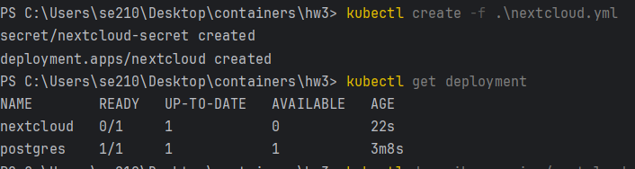
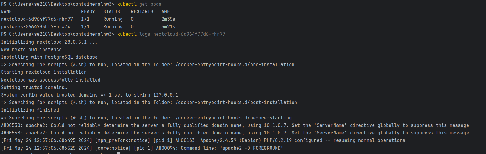
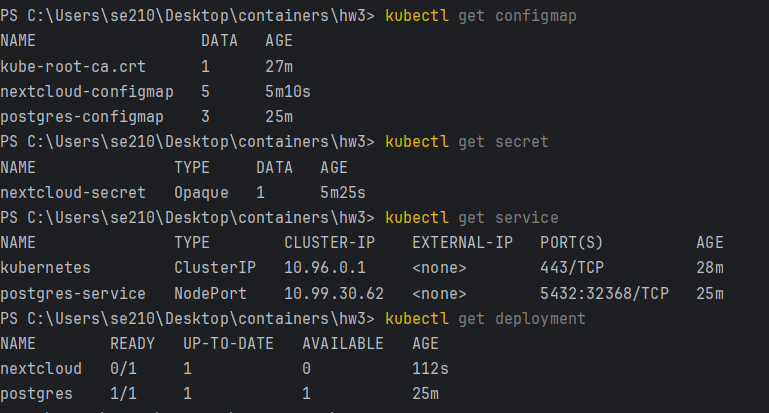
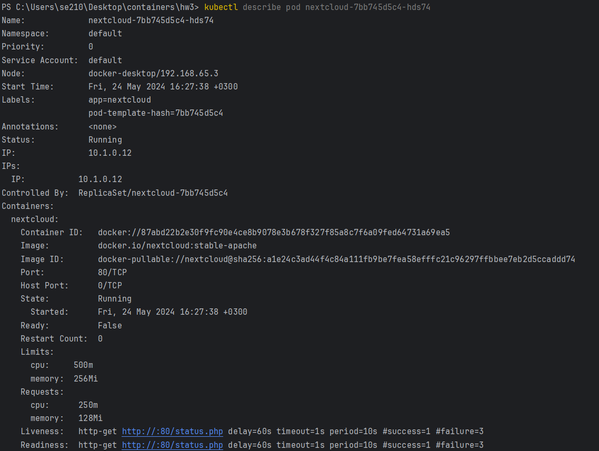
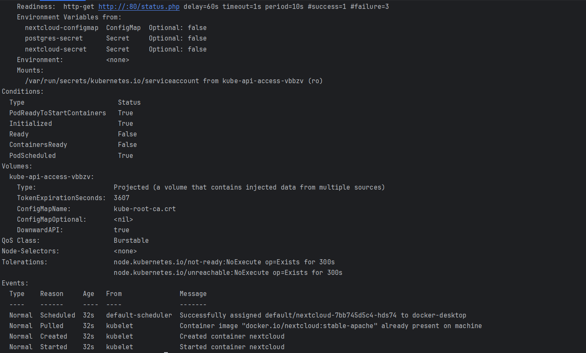

# HW3. Kubernetes

## Задача 
Установить Kubernetes на локальную машину. Развернуть тестовый сервис

## Описание
### Созданы объекты c исходным конфигом через CLI

### Запущен nextcloud с исходным конфигом

### Логин и пароль pg перенесены в секреты, переменные nextcloud перенесены в configmap, добавлены Liveness и Readiness пробы. 
Результат:

## Вопросы
### Важен ли порядок выполнения этих манифестов? Почему?
Да, важен. Т.к. деплой зависит от секретов и конфигмапов, он не сможет запуститься при несуществующих манифестах.

### Что (и почему) произойдет, если отскейлить количество реплик postgres-deployment в 0, затем обратно в 1, после чего попробовать снова зайти на Nextcloud? 
Nextcloud потеряет соединение с базой данных и вернет ошибку 500. Масштабирование postgres до 0 остановит БД, nextcloud потеряет к ней доступ. При масштабировании до 1 будет создан новый экземпляр БД, все данные будут потеряны.
